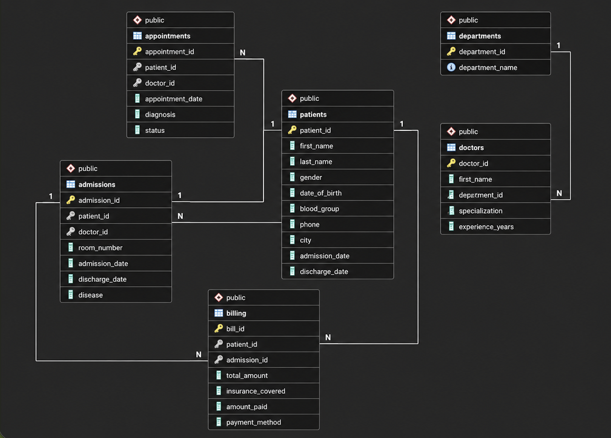
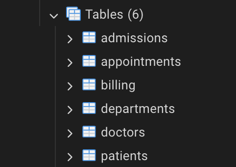
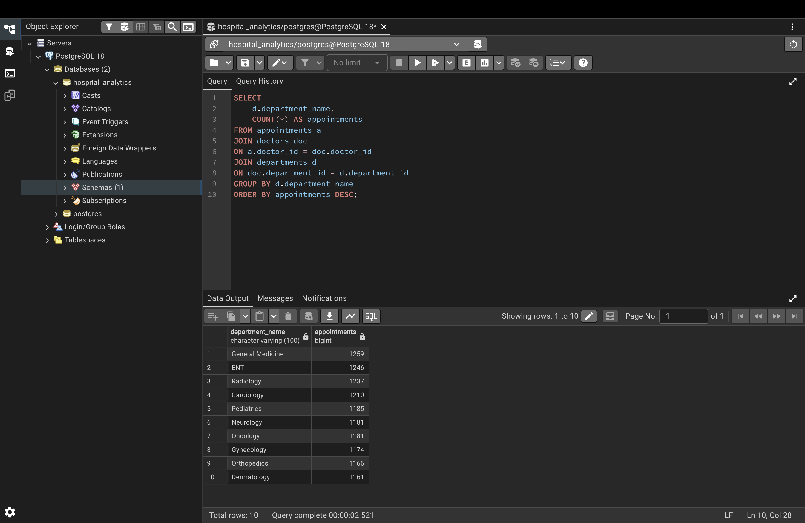

# 🏥 Hospital Analytics SQL

> **A complete end-to-end PostgreSQL analytics project** that simulates a real-world hospital database using synthetic data. The project demonstrates database design, ETL, advanced SQL, query optimization, and Python-based analytics.


---

# 📌 Overview

Hospital Analytics SQL is a relational database project designed to mimic the workflow of a modern hospital information system. It includes realistic synthetic patient records, doctor information, appointments, admissions, and billing data generated using **Faker**, stored in **PostgreSQL**, and analyzed through advanced SQL queries and Python visualizations.

The project demonstrates skills across:

* Relational Database Design
* PostgreSQL
* ETL Pipeline
* Advanced SQL
* Query Optimization
* Python + SQL Integration
* Data Analytics

---

# 🚀 Features

* 🏥 Normalized relational database
* 👨‍⚕️ 5 interconnected tables with foreign keys
* 🧑‍🤝‍🧑 5,000 synthetic patient records
* 👨‍⚕️ 120 doctors across multiple departments
* 📅 12,000+ appointments
* 🏨 1,200+ hospital admissions
* 💳 Billing and insurance simulation
* 📊 Advanced SQL analytics
* 📈 Python analytics notebook
* ⚡ Query optimization using indexes
* 📑 Reusable SQL views

---

# 📸 Screenshots

## Database Schema



---

## Database Tables



---

## Query Results



---

# 🏗 Project Architecture

```text
                    Faker
                      │
                      ▼
            generate_data.py
                      │
                      ▼
              CSV Data Files
                      │
                      ▼
            load_database.py
                      │
                      ▼
          PostgreSQL Database
                      │
        ┌─────────────┼─────────────┐
        ▼             ▼             ▼
   SQL Queries     SQL Views     Indexes
        │
        ▼
 Python Analytics Notebook
        │
        ▼
  Charts & Business Insights
```

---

# 🗄 Database Schema

The database consists of six normalized tables.

| Table        | Description               |
| ------------ | ------------------------- |
| departments  | Hospital departments      |
| patients     | Patient demographics      |
| doctors      | Doctor information        |
| appointments | Outpatient appointments   |
| admissions   | Hospital admissions       |
| billing      | Billing & payment details |

Relationships include:

* Department → Doctors
* Patient → Appointments
* Doctor → Appointments
* Patient → Admissions
* Doctor → Admissions
* Admission → Billing

---

# 📂 Project Structure

```text
HospitalAnalyticsSQL/

├── data/
│
├── notebooks/
│   └── hospital_analysis.ipynb
│
├── screenshots/
│
├── sql/
│   ├── 01_basic_queries.sql
│   ├── 02_aggregations.sql
│   ├── 03_joins.sql
│   ├── 04_subqueries.sql
│   ├── 05_ctes.sql
│   ├── 06_window_functions.sql
│   ├── 07_views.sql
│   ├── 08_indexes.sql
│   └── 09_query_optimization.sql
│
├── generate_data.py
├── load_database.py
├── schema.sql
├── requirements.txt
├── README.md
├── LICENSE
└── .gitignore
```

---

# ⚙️ Installation

Clone the repository

```bash
git clone https://github.com/oreomcflurryyy/HospitalAnalyticsSQL.git

cd HospitalAnalyticsSQL
```

Create a virtual environment

```bash
python -m venv venv
```

Activate it

### macOS/Linux

```bash
source venv/bin/activate
```

### Windows

```bash
venv\Scripts\activate
```

Install dependencies

```bash
pip install -r requirements.txt
```

---

# 🛠 Database Setup

Create a PostgreSQL database

```sql
CREATE DATABASE hospital_analytics;
```

Create all tables

```bash
psql hospital_analytics < schema.sql
```

Generate synthetic data

```bash
python generate_data.py
```

Load data into PostgreSQL

```bash
python load_database.py
```

---

# 📊 SQL Topics Covered

### Basic SQL

* SELECT
* WHERE
* ORDER BY
* LIMIT
* DISTINCT

---

### Aggregations

* COUNT
* SUM
* AVG
* MIN
* MAX
* GROUP BY
* HAVING

---

### Joins

* INNER JOIN
* LEFT JOIN
* Multi-table joins
* Foreign keys

---

### Subqueries

* Scalar Subqueries
* Nested Queries
* EXISTS
* IN
* NOT IN

---

### Common Table Expressions (CTEs)

* Recursive thinking
* Intermediate datasets
* Readable query pipelines

---

### Window Functions

* ROW_NUMBER()
* RANK()
* DENSE_RANK()
* NTILE()
* LAG()
* LEAD()
* Running totals
* Moving averages
* Percentile ranking

---

### Views

* Patient Summary
* Doctor Summary
* Admission Summary
* Billing Summary
* Department Revenue
* Hospital Dashboard

---

### Query Optimization

* Indexes
* EXPLAIN ANALYZE
* Query performance

---

# 📈 Python Analytics

The Jupyter notebook demonstrates how SQL integrates with Python for data analysis.

Analyses include:

* Revenue by department
* Disease distribution
* Patient distribution by city
* Gender ratio
* Doctor experience distribution
* Monthly admissions
* Payment method analysis
* Top-performing doctors

Libraries used

* pandas
* matplotlib
* SQLAlchemy
* psycopg2

---

# 💡 Sample SQL Queries

Top Revenue Departments

```sql
SELECT
    department_name,
    revenue
FROM department_revenue
ORDER BY revenue DESC;
```

Top Doctors by Appointments

```sql
SELECT
    first_name,
    last_name,
    total_appointments
FROM doctor_performance
ORDER BY total_appointments DESC;
```

Patients with Outstanding Bills

```sql
SELECT
    patient_id,
    total_amount,
    amount_paid
FROM billing
WHERE total_amount > amount_paid;
```

---

# 🛠 Technologies Used

* PostgreSQL
* SQL
* Python
* Faker
* Pandas
* SQLAlchemy
* psycopg2
* Matplotlib
* Jupyter Notebook

---

# 📚 Skills Demonstrated

* Database Design
* Relational Modeling
* SQL Querying
* Data Cleaning
* ETL Pipeline
* Data Generation
* Query Optimization
* Indexing
* Window Functions
* Data Visualization
* Python-PostgreSQL Integration

---

# 🚀 Future Improvements

* Interactive Streamlit dashboard
* Power BI dashboard
* Stored procedures and triggers
* Role-based authentication
* REST API with FastAPI
* Docker deployment
* Automated ETL pipeline
* Time-series forecasting for admissions

---

# 📄 License

This project is licensed under the MIT License.

---

# 👩‍💻 Author

**Eshanika Dey**

B.Tech, Bioscience & Biotechnology
Indian Institute of Technology Kharagpur

GitHub: https://github.com/oreomcflurryyy
